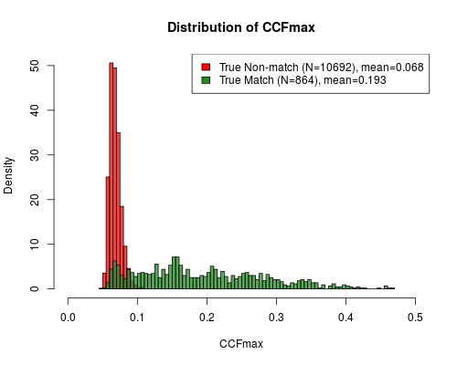
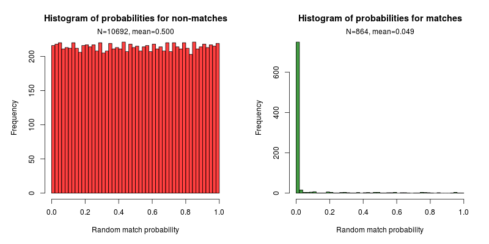

```{r setup, include=FALSE}
knitr::opts_chunk$set(echo = TRUE)
```

We analyze 108 images from the NBIDE data set, taken from NIST's ballistics research toolmark database, using the [`cartridges` package](https://github.com/xhtai/cartridges). For more details, refer to the package README.

## Code
* `readAllNBIDE.R` is used to pre-process the images (steps 1-4)
* `compareAllNBIDE.R` is used to do all pairwise comparisons within the database (step 5)
* `resultsNBIDE.R` some analysis of the results, and also computes probabilities (step 6)
* `prepareAllData.R` contains code for processing using previously published methods (see the third section of the code)

## Data
* `imageData.Rdata` contains information about each image: gun make and number, and cartridge make. These data are from the metadata for the NBIDE study which can be downloaded from the NIST database.
* [108 images processed using steps 1-4](https://app.box.com/s/bsgtumz1dmo7pwrhlclkdydn3i9c5gy7)
* [108 images processed using previously published methods](https://app.box.com/s/p8ailczfrvz057nb5kxv23s83d7e4l3c) (manually selecting the breechface marks, steps 2 and 4)


## Results
* `allResults.Rdata` contains results from all pairwise comparisons (11,556 in total): the correlation score, probabilities and best registration parameters.
* Some plots:





We also compare our results to the results from previously published methods, and note that performance for true matches is similar, whereas for true non-matches, our method produces lower scores. This is due to the removal of circular symmetry.


## Presentation
`Presentation_11-29.pdf` are slides presented on 11/29. Note that these results were produced using earlier code where steps 1, 4 and 5 were implemented in MATLAB. The current version has all the steps in R, and the implementations are not identical so there are slight differences in the numerical results. The overall conclusions remain the same.

The data used in the slides are available here:

* [Processed using steps 1-4](https://app.box.com/s/dguq02tjemimhcgj2gc0rdhau1cnou4d)
* [Processed data using previously published methods](https://app.box.com/s/o0dguefk95dy6zl3q9ypf08ksjbyl6wo) (manually selecting the breechface marks, steps 2 and 4)

## Write-up
Coming soon.

