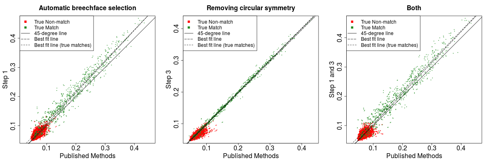

Analyzing cartridge images from the NBIDE study
================

We analyze 108 images from the NBIDE data set, taken from NIST's ballistics research toolmark database, using the [`cartridges` package](https://github.com/xhtai/cartridges). For more details, refer to the package README.

Code
----

-   [`readAllNBIDE.R`](https://github.com/xhtai/NBIDE-cartridges/blob/master/readAllNBIDE.R) is used to pre-process the images (steps 1-4)
-   [`prepareAllData.R`](https://github.com/xhtai/NBIDE-cartridges/blob/master/prepareAllData.R) contains code for processing using a different combination of steps
-   [`compareAllNBIDE.R`](https://github.com/xhtai/NBIDE-cartridges/blob/master/compareAllNBIDE.R) is used to do all pairwise comparisons within the database (step 5)
-   [`resultsNBIDE.R`](https://github.com/xhtai/NBIDE-cartridges/blob/master/resultsNBIDE.R) some analysis of the results, and also computes probabilities (step 6)

Data
----

-   `imageData.Rdata` contains information about each image: gun make and number, and cartridge make. These data are from the metadata for the NBIDE study which can be downloaded from the NIST database.
-   [108 images processed using steps 1-4](https://app.box.com/s/bsgtumz1dmo7pwrhlclkdydn3i9c5gy7)

To determine the effect of automatic selection of breechface marks (step 1) and the removal of circular symmetry (step 3), we also pre-process the data with and without these steps for comparison:

-   [108 images processed without steps 1 and 3 added](https://app.box.com/s/p8ailczfrvz057nb5kxv23s83d7e4l3c) (this would be the previously published method: manually selecting the breechface marks, steps 2 and 4)
-   [108 images processed with step 1 added](https://app.box.com/s/dh4owysmrzyciz9gsg7lbs1lh7eeic4y)
-   [108 images processed with step 3 added](https://app.box.com/s/gf22k07ixykcbdumbu6k21xs7x0o8s5y)

Results
-------

-   `allResults.Rdata` contains results from all pairwise comparisons (11,556 in total): the correlation score, probabilities and best registration parameters
-   `combinedResults.Rdata` contains results from all pairwise comparisons for different sets of pre-processing steps
-   Some plots:

We also compare our results to the results using different pre-processing steps, and note that with the addition of our proposed pre-processing steps, true matches have higher scores and non-matches have slightly lower scores. Overall performance is better.

Presentation
------------

[`Presentation_11-29.pdf`](https://github.com/xhtai/NBIDE-cartridges/blob/master/Prersentation_11-29.pdf) are slides presented on 11/29. Note that these results were produced using earlier code where steps 1, 4 and 5 were implemented in MATLAB. The current version has all the steps in R, and the implementations are not identical so there are slight differences in the numerical results. The overall conclusions remain the same.

The data used in the slides are available here:

-   [Processed using steps 1-4](https://app.box.com/s/dguq02tjemimhcgj2gc0rdhau1cnou4d)
-   [Processed data using previously published methods](https://app.box.com/s/o0dguefk95dy6zl3q9ypf08ksjbyl6wo) (manually selecting the breechface marks, steps 2 and 4)

Write-up
--------

Draft [here](https://github.com/xhtai/NBIDE-cartridges/blob/master/cartridge_cases.pdf).
